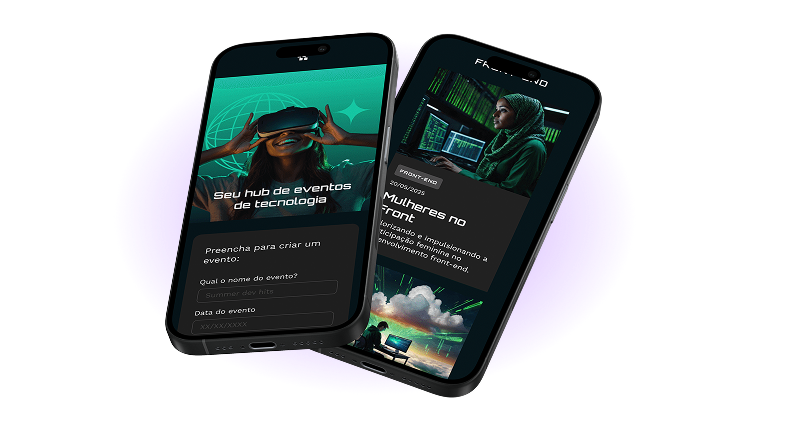

# Tecboard

Tecboard é uma aplicação de monitoramento em tempo real com alertas inteligentes para garantir que suas aplicações nunca saiam do ar sem você saber.

## 🎯 Sobre o Projeto

Tecboard oferece uma solução completa de monitoramento para suas aplicações, permitindo que você acompanhe o status em tempo real e receba alertas inteligentes sobre qualquer problema.



## 📁 Estrutura do Projeto

```
tecboard/
├── css/
│   └── style.css              # Estilos da aplicação
├── fonts/
│   ├── Poppins-Regular.ttf    # Fonte Poppins
│   └── Unbounded-Bold.ttf     # Fonte Unbounded
├── img/
│   ├── logo-tecboard-branco.png
│   ├── celulares-sobrepostos-mobile.png
│   └── celulares-sobrespostos-desktop.png
├── inde.html                  # Página principal
├── favicon-tecboard-roxo.svg  # Ícone da aplicação
└── README.md                  # Este arquivo
```

## 🎨 Design

- **Cores principais**: Roxo (#9747ff) e preto (#0e1014)
- **Tipografia**: Unbounded (títulos) e Poppins (corpo)
- **Responsivo**: Otimizado para desktop, tablet e mobile

## 📱 Responsividade

A aplicação é totalmente responsiva com breakpoints em:

- Desktop: 1920px+
- Tablet: até 768px
- Mobile: até 375px

## 🔧 Tecnologias

- HTML5
- CSS3
- Fontes customizadas (TTF)
